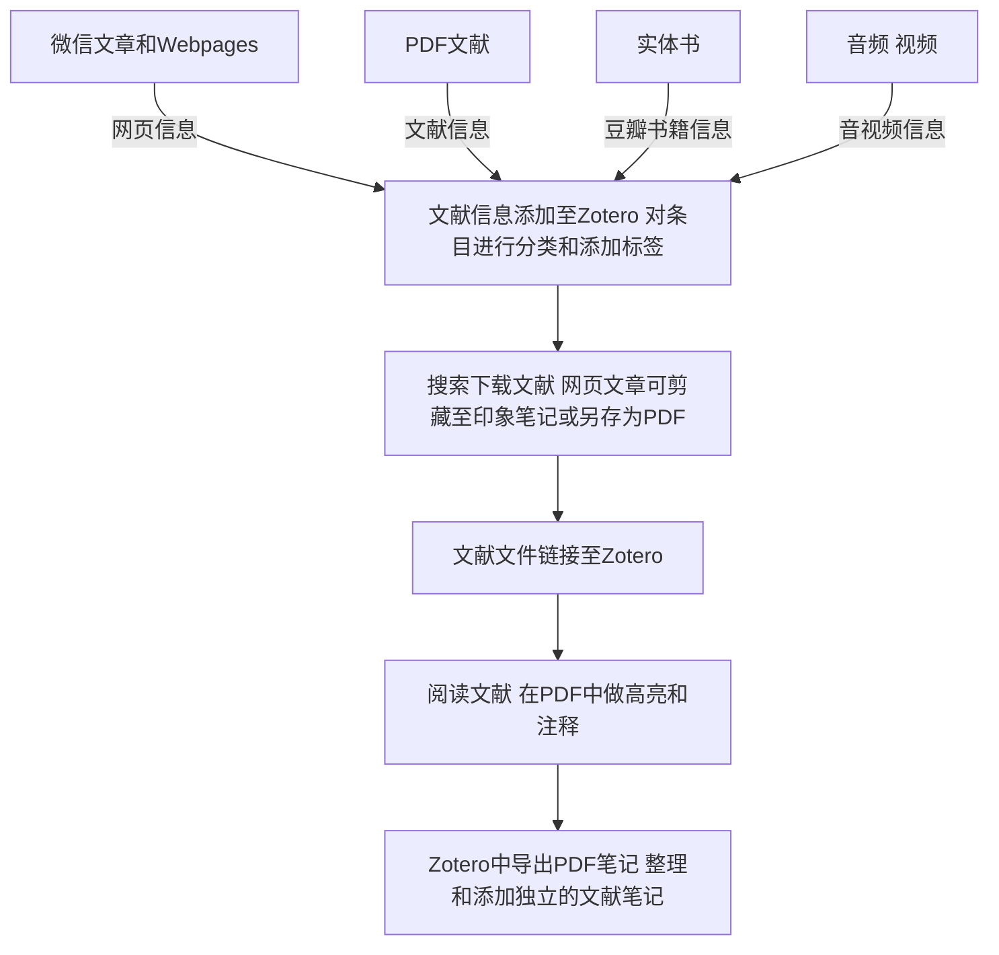

```mermaid
graph TD
A1[微信文章和Webpages]-->|网页信息|B[文献信息添加至Zotero 对条目进行分类和添加标签] 
A2[PDF文献]-->|文献信息|B
A3[实体书]-->|豆瓣书籍信息|B
A4[音频 视频]-->|音视频信息|B
B-->C[搜索下载文献 网页文章可剪藏至印象笔记或另存为PDF]
C-->D[文献文件链接至Zotero]
D-->E[阅读文献 在PDF中做高亮和注释]
E--> F[Zotero中导出PDF笔记 整理和添加独立的文献笔记]
```
